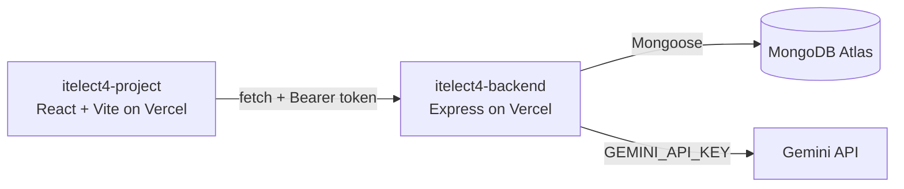

# ITELECT4 Backend

Live API: itelect4-backend-one.vercel.app/api/health

Frontend repo: https://github.com/EndayaRK/itelect4-project

Architecture

```mermaid
flowchart LR
fe["itelect4-project<br/>React + Vite on Vercel"]
be["itelect4-backend<br/>Express on Vercel"]
db[("MongoDB Atlas")]
ai["Gemini API"]
fe -- "fetch + Bearer token" --> be
be -- "Mongoose" --> db
be -- "GEMINI_API_KEY" --> ai
```
